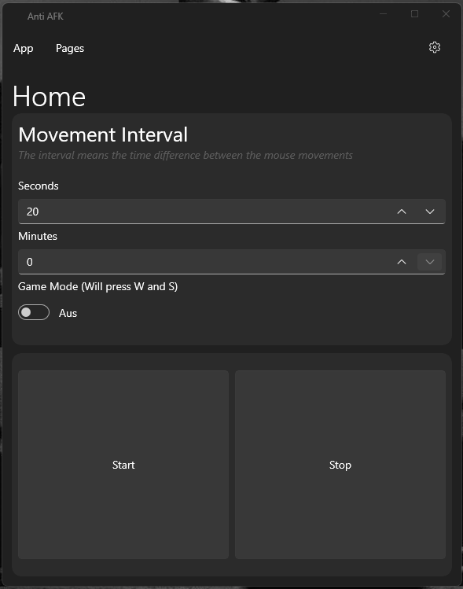

# Anti AFK
Anti-AFK is a program which simulates key presses and mouse movements so other apps can't detect that you're afk and not on your PC. 
You don't have to install the app on your PC to run it so you can use it even you haven't administrator permission on the computer you want to run it.

## Features
- Simulate mouse movements
- Gaming Mode
   - Simulates the W key
   - Simulates the S key
- Custom Movement/Pressing interval

## How to install?

- Download the latest release
- Unzip the folder
- Run the Anti-AFK.exe

## Preview

